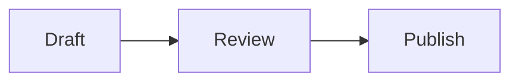

This is a starter post for the `eleventy-tech-blog` template. It exists to
show off the formatting the template supports, so you can delete it once
you've seen what's available.

## Text and code

Inline code looks like `this`, and fenced code blocks get syntax
highlighting:

```js
export function greet(name) {
  return `hello, ${name}`
}
```

## Footnotes

You can drop a footnote right into a sentence like this one.[^1] They render
at the bottom of the post and link back up to where they were used.

## Tables

| Feature       | Supported |
|---------------|-----------|
| Syntax highlighting | yes |
| Footnotes     | yes       |
| Mermaid diagrams | yes    |

## Diagrams

This template can render Mermaid diagrams directly from a fenced code block:



Replace this post — and the others in `content/posts/` — with your own
writing whenever you're ready.

[^1]: Like this. Footnote text can contain its own [links](https://www.11ty.dev) and formatting.
